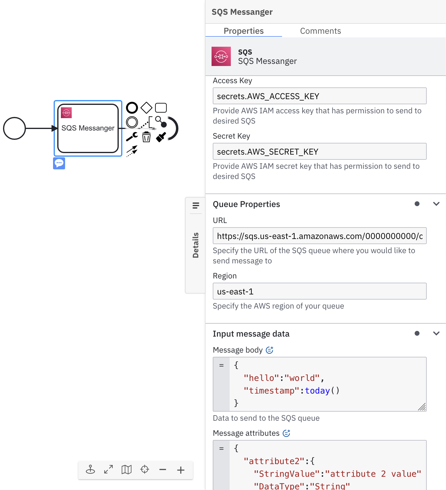
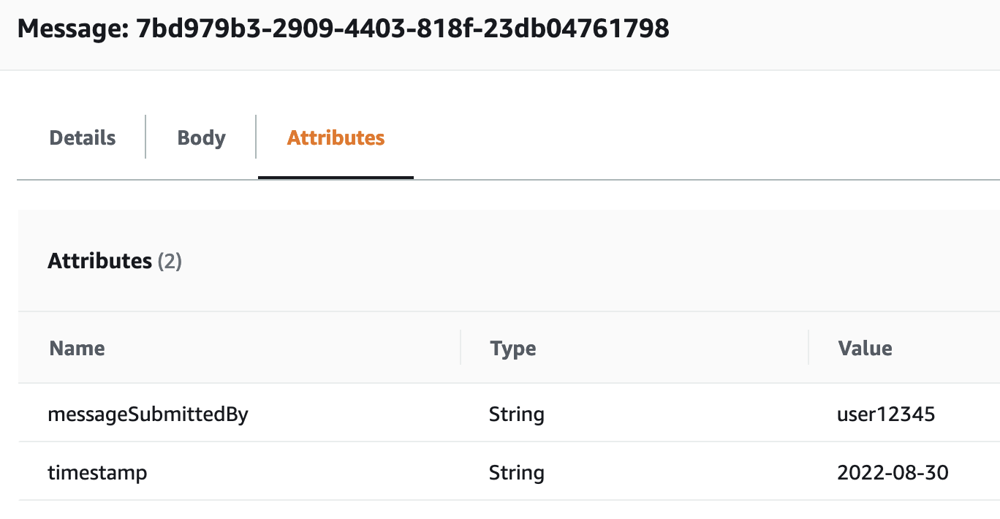

The AWS SQS Connector allows you to connect your BPMN service with the Amazon Web Services [Simple Queue Service](https://aws.amazon.com/sqs/).

## Prerequisites

Using an **AWS SQS Connector** is very simple. You only need to have an SQS Queue and IAM Key and Secret pair with `sqs:SendMessage` policy relative to your SQS. See [SQS Developer Guide](https://docs.aws.amazon.com/AWSSimpleQueueService/latest/SQSDeveloperGuide/sqs-basic-examples-of-iam-policies.html) to find out more.

## Create an AWS SQS Connector task

To use an **AWS SQS Connector** in your process, either change the type of existing task by clicking on it and using the wrench-shaped **Change type** context menu or create a new connector task by using the **Append Connector** context menu. Follow our [guide on using Connectors](../use-connectors.md) to learn more.

## Make your AWS SQS Connector for sending messages executable



1. Set relevant IAM Key and Secret pair in the **Authentication** section. For example, `secrets.MY_AWS_ACCESS_KEY`. The value can be as plain text but this is not recommended due to security concerns.
2. In the **Queue Properties** section, set the URL of your SQS queue as well as its region.
3. In the **Input message data** section, fill the field **Message body** with the data you would like to submit to the queue. The field requires FEEL input.
4. (Optional) In the **Input message data** section, fill the field **Message attributes** to set optional message metadata. This field requires FEEL input. See the relevant [appendix](#what-are-the-message-attributes-and-how-can-i-set-them) section to find out more about this field.

## AWS SQS Connector response

The **AWS SQS Connector** returns the SQS message identifier of a newly created message.
The response contains a `messageId` variable.

You can use an output mapping to map the response:

1. Use **Result Variable** to store the response in a process variable. For example, `myResultVariable`.
2. Use **Result Expression** to map fields from the response into process variables. For example:

```
= {
  "myCreatedMessage": response.messageId
}
```

## Appendix & FAQ

### What are the message attributes and how can I set them?

Amazon SQS lets you include structured metadata (such as timestamps, geospatial data, signatures, and identifiers) with messages using message attributes.
The **AWS SQS Connector** allows you to include non-binary message attributes in the section **Input message data**. The message attribute value has to be composed to be compliant with AWS SQS [message attribute data format](https://docs.aws.amazon.com/AWSSimpleQueueService/latest/SQSDeveloperGuide/sqs-message-metadata.html#sqs-message-attributes).

Example of a valid message attribute as a FEEL value:

```
= {
  "timestamp":{
    "StringValue":today(),
    "DataType":"String"
  },
  "messageSubmittedBy":{
    "StringValue":"user12345",
    "DataType":"String"
  }
}
```


